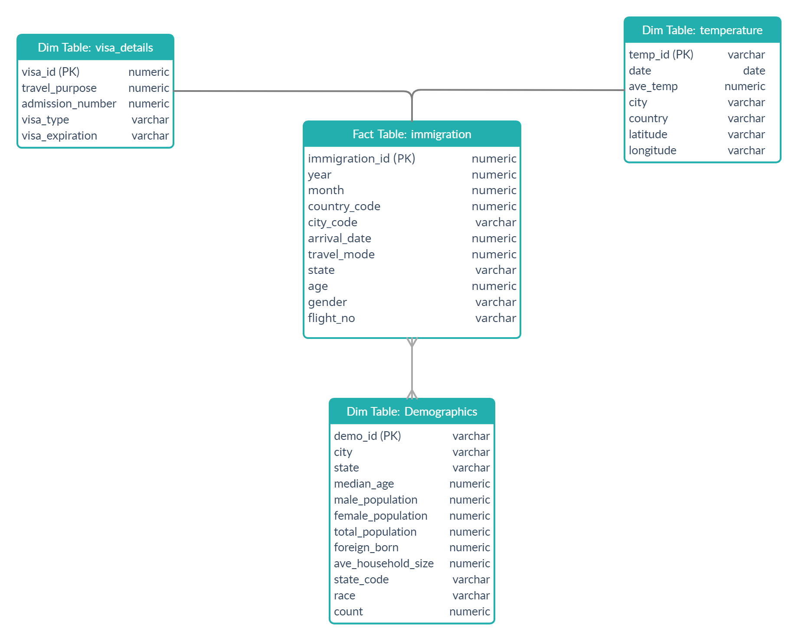
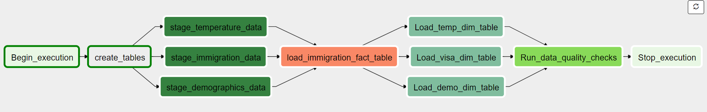

# Udacity Data Engineering Capstone Project: Automated-Data-Pipeline
## Data pipeline for immigration,temperature and demographics information
## Goal of the project

In this project the immigration information from the US is extracted from SAS files along with temperature and demographics information of the cities from csv files. The datasets are cleaned and rendered to JSON datasets on AWS S3. Later on JSON data is loaded on to staging tables on Redshift and then transformed to a star schema tables which also reside on Redshift. The whole pipeline is automated using Airflow.

## Usecases
The database schema was constructed for following usecases:
<ul>
<li>Get information regarding which cities and states were popular destinations for travelers/immigrants, the type of travel (sea/air etc.), age and gender information of travelers/immigrants. </li>
<li>Obtain correlation between popular immigrations/travel destinations and the temperature and demographic information of the destination.</li>
<li>Visa details such as visa type, visa expiration, travel purpose of the individuals. </li>
</ul>

## Database Model



## Tools and Technologies used
The tools and technologies used:
- __Apache Spark__ - Spark was used to read in the large data from SAS and CSV source files, clean them rewrite them in S3 bucket as JSON files.
- __Amazon Redshift__ - The staging tables as well as fact and dimension tables are created on Redshift.
- __Amazon S3__ - S3 is used to store the large amounts of JSON data created.
- __Apache Airflow__ - Airflow was used to automate the ETL pipeline.

## Source Datasets
The datasets used and sources include:
- __I94 Immigration Data__: 
This data comes from the US National Tourism and Trade Office. A data dictionary is included in the workspace. [here](https://travel.trade.gov/research/reports/i94/historical/2016.html) is where the data comes from. 
- __World Temperature Data__: This dataset came from Kaggle. You can read more about it [here](https://www.kaggle.com/berkeleyearth/climate-change-earth-surface-temperature-data).
- __U.S. City Demographic Data__: This dataset came from Kaggle. You can read more about it [here](https://public.opendatasoft.com/explore/dataset/us-cities-demographics/export/).
- __Airport Code Table__:This is a simple table of airport codes and corresponding cities. It comes from [here](https://datahub.io/core/airport-codes#data)

### DAG Representation

#### Main DAG



The convert_to_json.py file used to convert the source data to JSON data on S3 bucket is thought of as a one time run process to convert the data. Therefore, it is not implemented in the DAG as a task. 

## Installation

Firstly, clone this repo.

Create a virtual environment called venv and activate it
```
$ python -m venv venv
$ source venv/Scripts/activate
```
- If you are using linux to run Airflow, make sure to install all required python packages:
```
$ pip install -r requirements.txt
```

 - If you are using Windows, you need to launch Airflow using Docker. The required Docker configuration is included in the repo:
```
$ docker-compose up
```

You can access Airflow UI on your browser by going to:
```
http://localhost:8080/
```
Use user= user and password= password to login to Airflow.

## Workflow

1. Fill in your AWS access and secret keys in the aws.cfg file under  Airflow/ directory.

2. Create an S3 Bucket on AWS and fill in the S3_Bucket in aws.cfg with your bucket address (s3a://your_bucket_name)

3. Create a new folder called "data_sas" under airflow/data. Download the SAS data files from [here](https://travel.trade.gov/research/reports/i94/historical/2016.html) and copy them in the folder you just created. Also download "GlobalLandTemperaturesByCity.csv" from [here](https://www.kaggle.com/berkeleyearth/climate-change-earth-surface-temperature-data) and copy it under airflow/data along with other csv files (Because these data files are too large, they are not included in this repo. Therefore you need to download them manually).

4. Change to airflow/tools directory and run the convert_to_json.py. This will read in the source files into Spark, transform them to JSON and write to the given S3 bucket.
    ```
    python convert_to_json.py
    ```

5. Go to "http://localhost:8080/" in your browser. Click on the Admin tab and select Connections.


6. Under Connections, select Create.

7. On the create connection page, enter the following values:
- Conn Id: Enter aws_credentials.
- Conn Type: Enter Amazon Web Services.
- Login: Enter your Access key ID from the IAM User credentials.
- Password: Enter your Secret access key from the IAM User credentials.

Once you've entered these values, select Save and Add Another.

8. Create a Redshift cluster on AWS. On the next create connection page, enter the following values:
- Conn Id: Enter redshift.
- Conn Type: Enter Postgres.
- Host: Enter the endpoint of your Redshift cluster without the port at the end.
- Schema: Enter the Redshift database you want to connect to.
- Password: Enter the password you created when launching your Redshift cluster.
- Port: Enter 5439.

Once you've entered these values, select Save.

9. Run main_dag under DAGS by toggling its switch from off to on.


## How to handle possible scenarios
- The data was increased by 100x.
    - Because the data is already large Spark was our choice to read in and process the data. However if the data increases even more, Deploying spark on an EMR cluster would be a good solution.
- If the pipelines were needed to be run on a daily basis by 7am:
    - Dags can be set to run according to a schedule. So the main_dag in Airflow can be set to run everyday at 7am.
- If the database needed to be accessed by 100+ people:
    - Distribute the fact table and one dimension table on their common columns using DISTKEY.
    - Using elastic resize.


